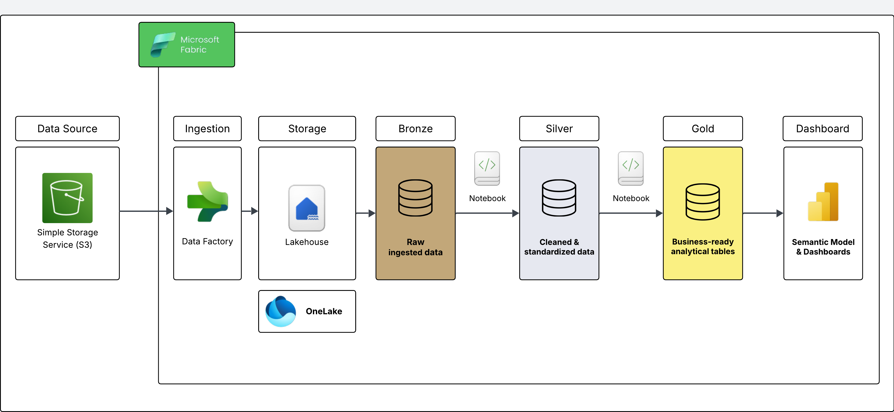

## Building a Unified Customer 360 View for an E Commerce Comapany

### Background
An e-commerce company operates across multiple channels — website, mobile app, customer service, and order management system.

However, the customer data is scattered across different systems, making it difficult to:

- Understand the full customer lifecycle
- Identify high-value customers
- Personalize marketing
- Improve customer retention

The leadership team wants a single view of the customer that brings together:

- Profile information
- Purchase behavior
- Payment history
- Customer support interactions
- Web and app activity


### Project Objective

Create a Customer 360° Dashboard in Microsoft Fabric by integrating and cleaning data from multiple messy sources using Lakehouse, PySpark, and Power BI to provide insights across the entire customer journey.

#### Data Sources


| Source System | Origin | What It Contains |
|--------------|--------|------------------|
| **customers.csv** | CRM System | Customer profile, gender, DOB, etc. |
| **orders.csv** | Order Management | Product orders, dates, values |
| **payments.csv** | Payment Gateway | Payment mode, status, amounts |
| **support_tickets.csv** | Zendesk / Support System | Complaints, resolutions, ticket logs |
| **web_activities.csv** | Website Analytics | Page views, device types, sessions |


### KPIs Tracked

| KPI | Description |
|----|----|
| **Total Customers** | Active customers with at least one transaction |
| **Average Order Value (AOV)** | Average spend per order |
| **Repeat Customer %** | Percentage of customers with two or more orders |
| **Open Tickets Count** | Number of unresolved customer complaints |
| **Churn Risk** | Customers with past support tickets and no recent orders |
| **Payment Mode Split** | Distribution of payments by Credit Card, UPI, Wallet, etc. |
| **Device Preference** | Web vs Mobile usage trend |


### Business Benefits

- **Personalized Marketing**  
  Segment customers by behavior and preferences.

- **Improved Customer Service**  
  Agents can see full customer history before responding to queries.

- **Smarter Decision-Making**  
  Leadership can track KPIs and customer churn.

- **360° Lifecycle View**  
  From signup → browse → order → pay → complaint.


### Architecture Diagram

This diagram illustrates a simple end-to-end data pipeline built using **Microsoft Fabric**, where data is ingested from **Amazon S3** using **Data Factory**, stored in a **Lakehouse backed by OneLake**, and transformed using the **Bronze–Silver–Gold (Medallion) architecture**.

The **Gold layer** serves business-ready analytical tables that are consumed directly by **Power BI (Semantic Model & Dashboards)** to deliver **Customer 360 insights**.




### Project Structure
```
├── Data/
├── Bronze_Raw_Data_Load.ipynb
├── Silver_Cleansed_Conformed.ipynb
├── Gold_Business_Marts.ipynb
├── Pipeline.png
├── fabric_medallion_architecture.png
└── README.md
```


### Description

- **Data/** – Raw source CSV files used for ingestion  
- **Bronze_Raw_Data_Load.ipynb** – Loads raw data into the Bronze layer  
- **Silver_Cleansed_Conformed.ipynb** – Cleans, standardizes, and conforms data for the Silver layer  
- **Gold_Business_Marts.ipynb** – Creates business-ready analytical tables in the Gold layer  
- **Pipeline.png** – End-to-end data pipeline flow diagram  
- **fabric_medallion_architecture.png** – Microsoft Fabric Bronze–Silver–Gold architecture diagram  
- **README.md** – Project documentation  

